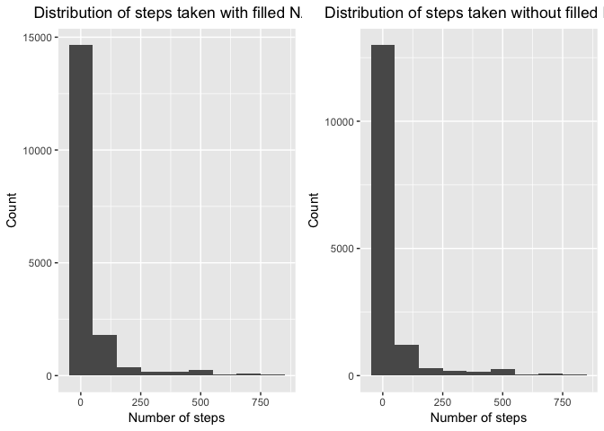

1 Loading and preprocessing the data
------------------------------------

    library(dplyr)
    library(ggplot2)
    library(gridExtra)
    data <- read.csv("activity.csv")
    data$date <- as.Date(data$date)
    na <- is.na(data$steps)
    data_clean <- data[!na, ]

2 What is mean total number of steps taken per day?
---------------------------------------------------

Calculate the total number of steps taken *per day*:

    total_per_day <- data_clean %>% group_by(date) %>% summarise(sum = sum(steps))

    ggplot(total_per_day, aes(date, sum)) + geom_line() + labs( x = "Date", y = "Sum of steps per day", title = "Total number of steps taken per day") + theme(plot.title = element_text(hjust = 0.5))

    total_per_day

    ## # A tibble: 53 x 2
    ##          date   sum
    ##        <date> <int>
    ##  1 2012-10-02   126
    ##  2 2012-10-03 11352
    ##  3 2012-10-04 12116
    ##  4 2012-10-05 13294
    ##  5 2012-10-06 15420
    ##  6 2012-10-07 11015
    ##  7 2012-10-09 12811
    ##  8 2012-10-10  9900
    ##  9 2012-10-11 10304
    ## 10 2012-10-12 17382
    ## # ... with 43 more rows

Make a histogram of the total number of steps taken each day:

    ggplot(data_clean, aes(steps)) + geom_histogram(binwidth = 100) + labs( x = "Number of steps", y = "Count", title = "Distribution of steps taken") + theme(plot.title = element_text(hjust = 0.5))

Calculate and report the mean and median of the total number of steps
taken per day:

    mean_med <- data_clean %>% group_by(date) %>% summarise(mean = mean(steps), median = median(steps))

    ggplot(mean_med, aes(x = date)) + geom_line(aes(y = mean, colour = "blue")) + geom_line(aes(y = median, colour = "red")) + labs( x = "Date", y = "Mean / median steps per day", title = "Mean and median steps per day", color = "Legend Title\n") + scale_color_manual(labels = c("mean", "median"), values = c("blue", "red")) + theme(plot.title = element_text(hjust = 0.5))

3 What is the average daily activity pattern?
---------------------------------------------

Make a time series plot of the 5-minute interval (x-axis) and the
average number of steps taken, averaged across all days (y-axis):

    five_min <- data_clean %>% group_by(interval) %>% summarise(mean = mean(steps), max = max(steps))

    ggplot(five_min, aes(interval, mean)) + geom_line() + labs( x = "5 min interval", y = "Mean of steps", title = "Average steps taken in 5-minute interval") + theme(plot.title = element_text(hjust = 0.5))

Which 5-minute interval, on average across all the days in the dataset,
contains the maximum number of steps?

    max_steps <- max(five_min$max)
    max_int <- five_min[five_min[, 3] ==max_steps, 1]

**Answer:** **The interval 615 contains the maximum number of 806
steps.**

4 Imputing missing values
-------------------------

Calculate and report the total number of missing values in the dataset
(i.e. the total number of rows with NAs)

    NAs <- as.data.frame(is.na(data))
    NA_steps <- data[NAs$steps, 1]
    NA_date <- data[NAs$date, 2]
    NA_interval <- data[NAs$interval, 3]

    result <- cbind(as.data.frame(names(data)), as.data.frame(c(length(NA_steps), length(NA_date),length(NA_interval))))
    names(result) <- c("Variables", "NAs")
    result

    ##   Variables  NAs
    ## 1     steps 2304
    ## 2      date    0
    ## 3  interval    0

Filling in all of the missing values with the mean for the interval and
create a new dataset (data2) that is equal to the original dataset but
with the missing data filled in:

    mean_int <- data_clean %>% group_by(interval) %>% summarise(mean = mean(steps))
    data2 <- left_join(data, mean_int)
    data2$steps[NAs$steps] <- data2[NAs$steps, 4]
    data2 <- data2[, 1:3]
    head(data2)

    ##       steps       date interval
    ## 1 1.7169811 2012-10-01        0
    ## 2 0.3396226 2012-10-01        5
    ## 3 0.1320755 2012-10-01       10
    ## 4 0.1509434 2012-10-01       15
    ## 5 0.0754717 2012-10-01       20
    ## 6 2.0943396 2012-10-01       25

Make a histogram of the total number of steps taken each day and
Calculate and report the mean and median total number of steps taken per
day. Do these values differ from the estimates from the first part of
the assignment? What is the impact of imputing missing data on the
estimates of the total daily number of steps?

Compare data and data2 by histograms:

    p1 <-ggplot(data2, aes(steps)) + geom_histogram(binwidth = 100) + labs( x = "Number of steps", y = "Count", title = "Distribution of steps taken with filled NAs") + theme(plot.title = element_text(hjust = 0.5))

    p2 <- ggplot(data_clean, aes(steps)) + geom_histogram(binwidth = 100) + labs( x = "Number of steps", y = "Count", title = "Distribution of steps taken without filled NAs") + theme(plot.title = element_text(hjust = 0.5))

    grid.arrange(p1, p2, ncol=2)

Compare data and data2 by mean and median total number of steps taken
per day:

    mean_med2 <- data2 %>% group_by(date) %>% summarise(mean = mean(steps), median = median(steps))

    p3 <- ggplot(mean_med, aes(x = date)) + geom_line(aes(y = mean, colour = "blue")) + geom_line(aes(y = median, colour = "red")) + labs( x = "Date", y = "Mean / median steps per day without filling NAs", title = "Mean and median steps per day", color = "Legend Title\n") + scale_color_manual(labels = c("mean", "median"), values = c("blue", "red")) + theme(plot.title = element_text(hjust = 0.5))

    p4 <- ggplot(mean_med2, aes(x = date)) + geom_line(aes(y = mean, colour = "blue")) + geom_line(aes(y = median, colour = "red")) + labs( x = "Date", y = "Mean / median steps per day", title = "Mean and median steps per day with filling NAs", color = "Legend Title\n") + scale_color_manual(labels = c("mean", "median"), values = c("blue", "red")) + theme(plot.title = element_text(hjust = 0.5))

    grid.arrange(p3, p4, ncol=2)

What is the impact of imputing missing data on the estimates of the
total daily number of steps?

    compare <- left_join(mean_med2, mean_med, by = "date")
    names(compare) <- c ("date", "mean_filled_NAs", "median_filled_NAs", "mean_orig", "median_orig")
    compare <- compare [, c(1, 4, 2, 5, 3)]
    compare

    ## # A tibble: 61 x 5
    ##          date mean_orig mean_filled_NAs median_orig median_filled_NAs
    ##        <date>     <dbl>           <dbl>       <dbl>             <dbl>
    ##  1 2012-10-01        NA        37.38260          NA          34.11321
    ##  2 2012-10-02   0.43750         0.43750           0           0.00000
    ##  3 2012-10-03  39.41667        39.41667           0           0.00000
    ##  4 2012-10-04  42.06944        42.06944           0           0.00000
    ##  5 2012-10-05  46.15972        46.15972           0           0.00000
    ##  6 2012-10-06  53.54167        53.54167           0           0.00000
    ##  7 2012-10-07  38.24653        38.24653           0           0.00000
    ##  8 2012-10-08        NA        37.38260          NA          34.11321
    ##  9 2012-10-09  44.48264        44.48264           0           0.00000
    ## 10 2012-10-10  34.37500        34.37500           0           0.00000
    ## # ... with 51 more rows

**Answer:** Imputting missing data effects the mean of days were data
was not available and median of daily number of steps.

5 Are there differences in activity patterns between weekdays and weekends?
---------------------------------------------------------------------------

The dataset with the filled-in missing values is used for this part.

Create a new factor variable in the dataset with two levels – “weekday”
and “weekend” indicating whether a given date is a weekday or weekend
day:

    weekdays <- c('Montag', 'Dienstag', 'Mittwoch', 'Donnerstag', 'Freitag')
    data2$days <- factor((weekdays(data2$date) %in% weekdays), 
             levels=c(FALSE, TRUE), labels=c('weekend', 'weekday')) 

Make a panel plot containing a time series plot of the 5-minute interval
(x-axis) and the average number of steps taken, averaged across all
weekday days or weekend days (y-axis):

    five_min2 <- data2 %>% group_by(interval, days) %>% summarise(mean = mean(steps))

    ggplot(five_min2, aes(interval, mean)) + geom_line() + facet_grid(days ~ .) + labs( x = "5 min interval", y = "Mean of steps", title = "Average steps taken in 5-minute interval") + theme(plot.title = element_text(hjust = 0.5))

